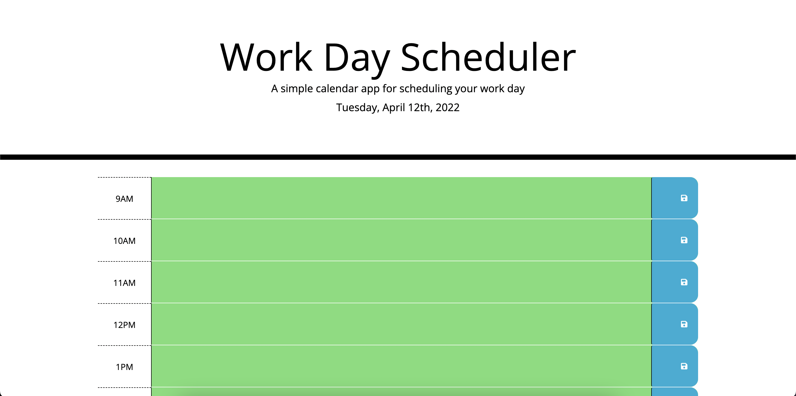

# Work Day Scheduler

## Description
Welcome to the Work Day scheduler web app. Designed to keep you on track and on task with your days, Mondays through Friday, 9 to 5.

## Usage
To use this application, just open it up in your favorite browser, select the appropriate hour your tasks are due for, and write them in. Once that's done, hit the save button on the right. That way, if you close your window for any reason, you can see your tasks pop right back up on the screen.

## Languages Used
* HTML
* JavaScript
* CSS

## Preview

## Link
https://justjulio95.github.io/calendar-project/